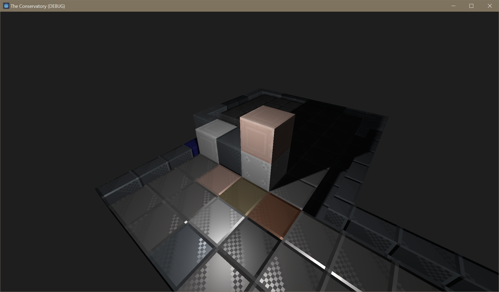
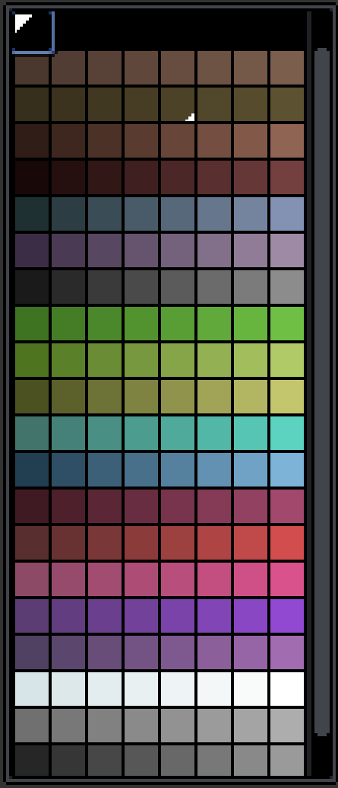

# 31 May 2024 - Terrain Voxel Rendering
[&lt;&lt;&lt; Previous Post](../05/25.md)
[Next Post &gt;&gt;&gt;](../06/14.md)
 
***
&nbsp;&nbsp;Terrain Voxel Rendering is definitely a bit of a challenge. I have to render *a lot* of geometry *really quickly* or else the game hitches and you have to stand there waiting for it to load.

&nbsp;&nbsp;The thing is, I also want quality. A huge inspiration is stuff like *Minecraft*, but one thing Minecraft distinctly lacks (primarily due to artstyle, not limitations) is real lighting.

## PBR

&nbsp;&nbsp;For this reason, my voxels allow a full set of PBR (**P**hysically **B**ased **R**endering) textures:

* `texture-albedo.png` is the color of the texture. It also supports color palettes.
* `texture-normal.png` is a normal map. This basically uses colors to store a direction in 3D relative to the surface (which is why they are often very blue, because blue is Z, and Z is forward). These directions tell the game how light should reflect off of a surface without actually requiring that to be in the mesh itself.
* `texture-smoothness.png` is a black/white texture where black indicates a rough, matte material, and white indicates a smooth, shiny material.
* `texture-metallic.png` is a black/white texture that changes how shinyness looks. Black makes shiny materials look "plasticy", and white makes them look like polished metal.
* `texture-emission.png` is a black/white texture that tells the system which pixels glow and how strongly they do so. The color is copied from albedo.

&nbsp;&nbsp;All of these are optional but very useful, as seen here for some metal blocks:

## Color Palettes

&nbsp;&nbsp;One of the things I really like about *Starbound*, another game that inspired mine, is that you can paint blocks. I want to add this feature to my game, and to do so, I have to make voxels that can optionally use color palettes instead of colored textures.

&nbsp;&nbsp;Implementing this wasn't too hard as you can see in the image up above, those blocks use palettes and then I have a dedicated "metallic block" palette type for coloring metals like that.

&nbsp;&nbsp;The way palettes work is based on gradients, each gradient has 8 shades of color. Voxels can store anywhere from 2 to 8 uniquely colored parts (specifically either 2, 3, 5, or 8 due to data packing stuff). The amount of colorable parts is determined by myself or a modder when a new voxel is added to the game's code. You don't have to use all the parts you allocate, though.

&nbsp;&nbsp;Here's the nature and foliage palette.

{width=25%}

&nbsp;&nbsp;Can you see how each color row has 8 shades of a color? Now, these gradients don't have to be one color. If you wanted to do an exotic shift from blue to violet in one of these rows, you can!

!!! info "Nerd Section - Read this only if you want tech details"

    As you ask for more parts, the amount of color choices goes away:

    * 2 parts allows 256 different color choices per part
    * 3 parts allows 32 different color choices per part
    * 5 parts allows 8 different color choices per part
    * 8 parts allows 4 different color choices per part

    If you wonder why it works this way, it's because palette information is stored in 16 bits. 8 bits is a byte, and a byte can count up to 255 (0 thru 255 is 256 unique numbers, 0 is a number too, you know!). **Counting in binary:**

    * 2x256: `00000000` `00000000`
    * 3x32: `00000` `00000` `00000` `.` (1 wasted bit, I only use 15 of the 16)
    * 5x8: `000` `000` `000` `000` `000` `.` (again 1 wasted bit)
    * 8x4: `00` `00` `00` `00` `00` `00` `00` `00`

&nbsp;&nbsp;Of course, for those of you who want better artistic control, you can also elect to just not use a palette for your material and instead use an RGB texture.