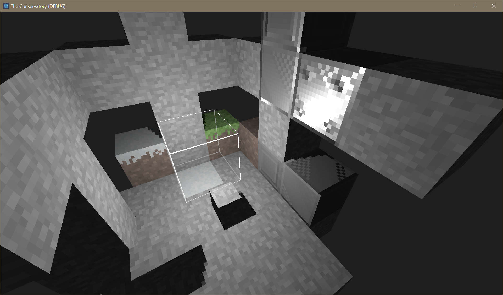
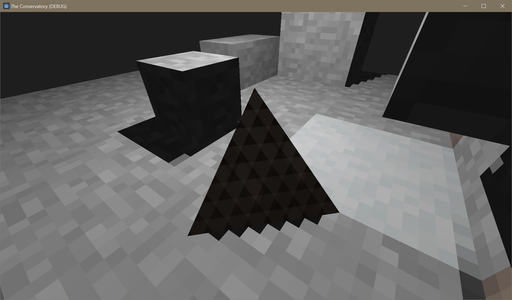

# 14 June 2024 - Pixel Art Shadows
[&lt;&lt;&lt; Previous Post](../05/31.md)
[Next Post &gt;&gt;&gt;](../06/27.md)
 
***
&nbsp;&nbsp;If you look at the [previous blog post about terrain rendering](../05/31.md) you will see that the shadow there is really sharp. It doesn't match the pixel art aesthetic at all!

&nbsp;&nbsp;Well, lucky for you, **a new Godot feature could not have better timing. Using this new feature, I am able to snap shadows to pixels!**

&nbsp;&nbsp;Unfortunately, there is a nasty bug that I can't really figure out where sloped surfaces get all sorts of horrible artifacts. This doesn't bode well for higher poly prop models that I plan to include in the game. Look here:

