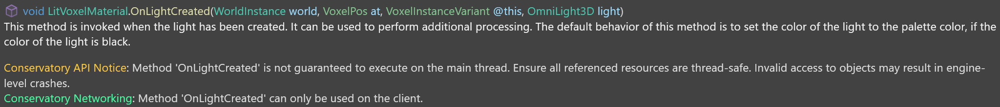

# 27 June 2024 - Roslyn Analyzers and VSIX
[&lt;&lt;&lt; Previous Post](../06/14.md)
[Next Post &gt;&gt;&gt;](../07/13.md)
 
***
&nbsp;&nbsp;*Roslyn* is the system running Visual Studio's C# analyzer and compiler. C# is the programming language I use to make the game.

&nbsp;&nbsp;The analyzer is responsible for basically idiot-proofing (to an extent) the code I write by informing me of mistakes of possible accidents ahead of time so that the most obvious and preventable issues can be prevented. For example, making a value and then never using it will raise an alert informing me of such.

&nbsp;&nbsp;*VSIX*, on the other hand, is an extension framework used to customize Visual Studio.

## The Conservatory Analyzer

&nbsp;&nbsp;I wanted to make my own analyzer for modders, since you can create custom behavior for the analyzer and add custom warnings, really useful for the quirks of the game to make life easier for modders.

&nbsp;&nbsp;There's just one small issue: I wanted to add unique text highlighting and messages to info popups when you hover your mouse over stuff. And that's where I majorly fucked up. I was a fool to desire something that seemed so simple.

&nbsp;&nbsp;That's right, this is a bit of a rant because I don't think I have ever been so irritated by code before.

### History of .NET

&nbsp;&nbsp;So for context, we need to learn about .NET's hilariously complicated past.

&nbsp;&nbsp;.NET is the system that underlies C#. You have probably seen it from time to time especially in older programs, "You need to install .NET Framework for this!" or whatever else.

&nbsp;&nbsp;In the archaic past, we actually had *three* .NETs:

1. .NET *Framework*, which was a windows-focused specialized toolkit designed for making desktop applications.
2. .NET *Core*, which was a cross-platform generalized toolkit where you could write code once and have it work on every OS. It could also write web applications and a few other doohickeys that I won't get into
3. .NET *Standard*, which is basically *Core*'s older brother. Standard stopped after 2.0 and Core took over from there.

&nbsp;&nbsp;Both of these could mostly do the same thing if you ignored the platform specialization, but they were very different.

&nbsp;&nbsp;After these two coexisted for a long time, Microsoft realized the problem and was like "we can't keep maintaining two of the same thing". This was a hurdle because .NET Framework ended on version 4.8, but .NET Core ended on version 3.1, and they both had their specialties. They needed to merge them together, though.

&nbsp;&nbsp;What they ended up doing was siding with .NET Core (a good choice, I think, because it was the one that worked on all platforms).

&nbsp;&nbsp;Remember how I brought up the version numbers? That was a small problem for the new unified system, which is called ".NET" - plain, no word after it. Just ".NET". So if you ever see me say that without "Framework" or "Core" after it, I mean the new unified one. Ok?

&nbsp;&nbsp;So - .NET began on version ... 5! Yes, the first release was version 5. This might sound really weird, but honestly it was kind of genius to stop *even more* confusion from adding up. People would likely download Core or Framework if it started on 1 because they would see the bigger version numbers of Framework/Core and go "oh, those must be newer", when that is not in fact true.

&nbsp;&nbsp;Thankfully, after .NET 5 dropped, things got way less confusing. It's actually quite elegant! Namely:

* Every year, a new .NET releases. They are currently about to release .NET 9, The Conservatory uses .NET 8.
* Every even version number (6, 8, ...) is "Long-Term Support", or LTS for short. It stays supported for longer than the odd releases.

**But we are talking about Roslyn Analyzers in this blog post.** That's right, we're going back to hell.

### So how does this tie into the history lesson you just gave me?

&nbsp;&nbsp;As mentioned, Roslyn isn't the only thing I wanted. **Roslyn** can do code analysis and produce warnings, but that's half the equation. I also wanted *custom display*, through a **VSIX Extension**. Like when you hover your mouse over a thing, I wanted a custom message with my own special format unique to the game to really help figure out what's going on. I actually got this to work, see:

&nbsp;&nbsp;Well, this is where I open pandora's box and call the swarm of locusts a bunch of pussies. Roslyn is the system that compiles C# code. C# has to work everywhere, **so Roslyn runs on .NET Standard.**

&nbsp;&nbsp;VSIX, however, is for Visual Studio (*not Visual Studio Code, by the way. Just "Visual Studio". The proper IDE, not the fancy text editor*). Visual Studio is a Windows application, **so VSIX runs on .NET Framework.**

&nbsp;&nbsp;You starting to see the problem?

&nbsp;&nbsp;I want to use both at once, **but they are fundamentally incompatible with each other.** My solution to this shown above barely works, like it's *janky*. Like it's bad. I trashed that project it was so bad. I'll try again later.

&nbsp;&nbsp;The solution is like ... holy shit. It's simultaneously one of the most stupid yet one of the most "yeah thats what i woulda did" type tricks, and I learned it from some Chinese repository I forgot the name of, but basically the solution goes like this:

1. Package the .NET Framework *Common Language Runtime* (the thing that makes C# work) into a `.dll` file
2. Load .NET Standard for Roslyn, and create the analyzers
3. *Load the entire runtime for .NET Framework as an addon to the code???*
4. Load VSIX through the loaded runtime
5. Revel at the homonculus baby of the two versions of .NET that you have just forcefully merged into an unidentifiable screaming monstrosity
6. Repent for your sins (Optional)
7. Profit

&nbsp;&nbsp;And yeah. It works, sort of. It's by far the most fucked up solution I think I have ever seen. But it works. Sort of.

&nbsp;&nbsp;The issue is that the runtime exists in a discrete state. It's a runtime, so it tries to do what it would do on a normal computer and load the code into its own little bubble. This means that the code existed in this weird limbo state where it was *technically* loaded by .NET standard but only sort of, and the real thing still lived in the Framework bubble. I could access those parts of the code but I had to use a weird shared memory page hack and it was a *disaster*. I don't even want to articulate how hilariously hacky it was.

&nbsp;&nbsp;Later in the future I'll probably try it again in a more sane way, but that means I have to develop two apps together instead of just one. Fuck.