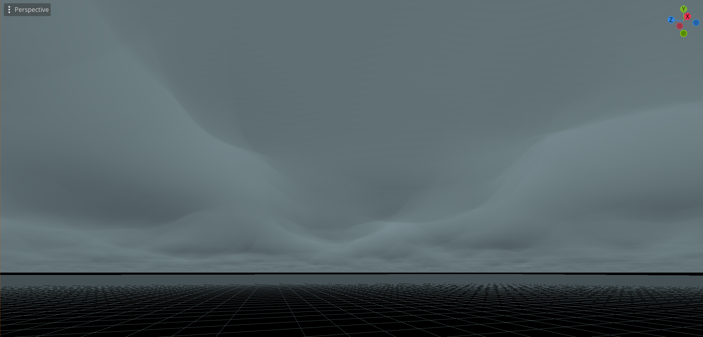

# 13 July 2024 - The Sky of *Numala*
[&lt;&lt;&lt; Previous Post](../06/27.md)
[Next Post &gt;&gt;&gt;](../08/03.md)
 
***
&nbsp;&nbsp;One of the playable races in the game is *The Kirivans*. You can read about them here: *[Playable Races: Kirivian](../../races/kirivian.md).*

&nbsp;&nbsp;Their home world, called *Numala*, is perpetually overcast due to some funky space jargon and sci-fi bullshittery (again, check the page linked above).

&nbsp;&nbsp;They are particularly special to me as they capture a very specific feeling and interest of mine, so I put a lot of time into ensuring the atmosphere of their world was just right: Imagine *a rainy spring day.*

&nbsp;&nbsp;One of the things that can pretty dramatically affect this sensation is the background environment, such as the sky. It is a huge part of the set that makes up the world and so I put a lot of time into it, it has a custom shader designed to render smooth, rolling clouds. I am very proud of how it came out.

&nbsp;&nbsp;Writing shaders has always been one of my hidden passions because it is the good way (i.e. not AI slop) to link art to programming. I am instructing a rock that's really good at math with decimals on how to build the colors needed to draw a sky.

&nbsp;&nbsp;It feels good being a lithomancer.