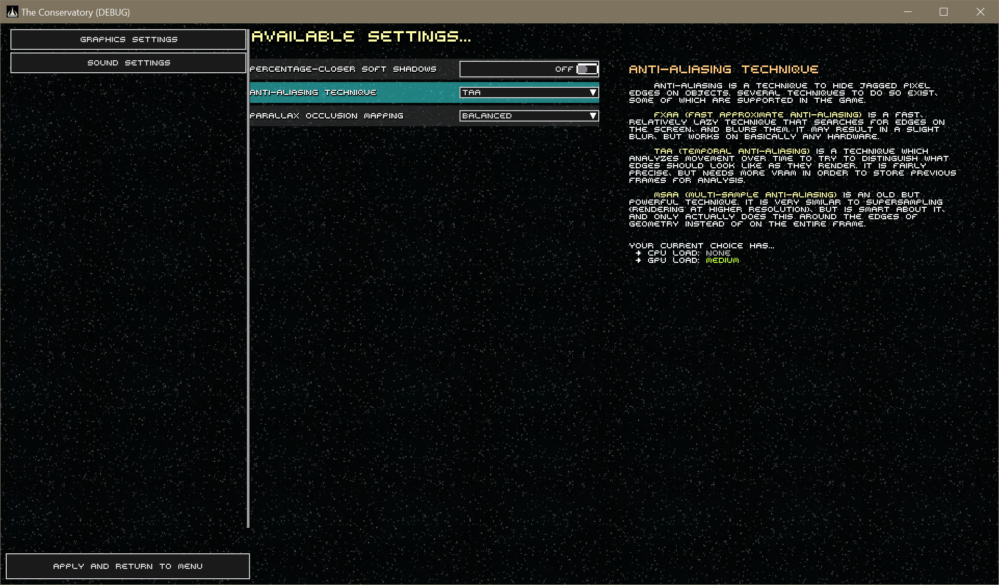

# 3 August 2024 - The Settings Menu, Mod Configs
[&lt;&lt;&lt; Previous Post](../07/13.md)
[Next Post &gt;&gt;&gt;](../09/27.md)
 
***

!!! tip "This is a technical post!"
    The subject matter of this post is oriented to other programmers and would-be modders. It may be difficult to understand and I am assuming the reader has programming knowledge, but I will try to make it easy to read.

&nbsp;&nbsp;I just finished the framework for the **Config/Options Screen, *which includes the API used by modders to configure your mods.***

&nbsp;&nbsp;This thing is fancy and *extensible*. If you have modded other games you know how much of a pain in the ass it is to make configs because you gotta make custom types, or split your type into separate sliders and values and do all the menu bullshit and ugh, right?

&nbsp;&nbsp;The Conservatory comes with something far nicer. It is a system designed on programmatical interfaces.

&nbsp;&nbsp;A great way to think of them is to consider the symbols and buttons we use on apps and pages across the internet. Everybody's looks different, but the moment you see a hamburger menu icon ≡, you know it opens a menu. Everybody's menu is different and done in their own way, yet you still understand how to use every single one of them on the internet. An `interface` type in code is basically that, for the computer: A way to use something that is simple and universal.

&nbsp;&nbsp;Interfaces are extremely powerful for this reason because they take potentially very different code from many places, and create one, unified way to interact with it.

&nbsp;&nbsp;If you want code details, check out <a href="../../../../docs/doxygen/interface_star3_d_1_1_configuration_1_1_values_1_1_i_configuration_value.html">the documentation of `IConfigurationValue<T>` here</a>.

&nbsp;&nbsp;But in basic terms:

* `IConfigurationValue` is agnostic and has a non-generic, `object`-based instance for ease of use.
* `IConfigurationValue<T>` is strictly typed.
* `IRangedConfigurationValue<T>` is a range type `where T : INumber<T>` - meaning that ***any numeric type, even custom types of numbers that you invented, are allowed.*** All you need is the ability to convert it to/from float.
* A few others.

&nbsp;&nbsp;More basically, these values are **supported by default:**

* `bool` for switches/toggles
* `object[]` (but particularly `ObjectIdentity[]` for built in localization) for dropdown menus.
* `INumber<T>` for sliders of *any numeric type.*
* `Godot.Color` for a full color selection wheel (HSV, RGB, Hex, sliders, hue circle, the whole thing).
* `string` for optionally validated text input.

&nbsp;&nbsp;You can add more types if desired, you just need to make the menu element for interacting with it (the value itself, the game handles the rest for you.)

&nbsp;&nbsp;Here is a prototype of the options screen which is missing a lot of the options I plan to have.

{width=75%}

