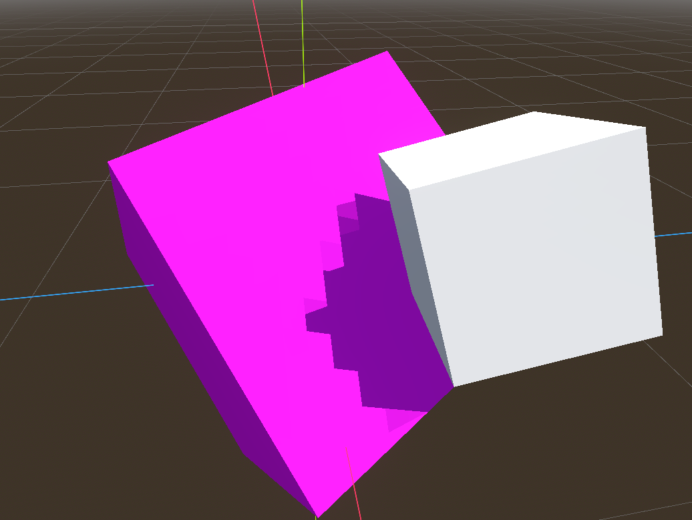
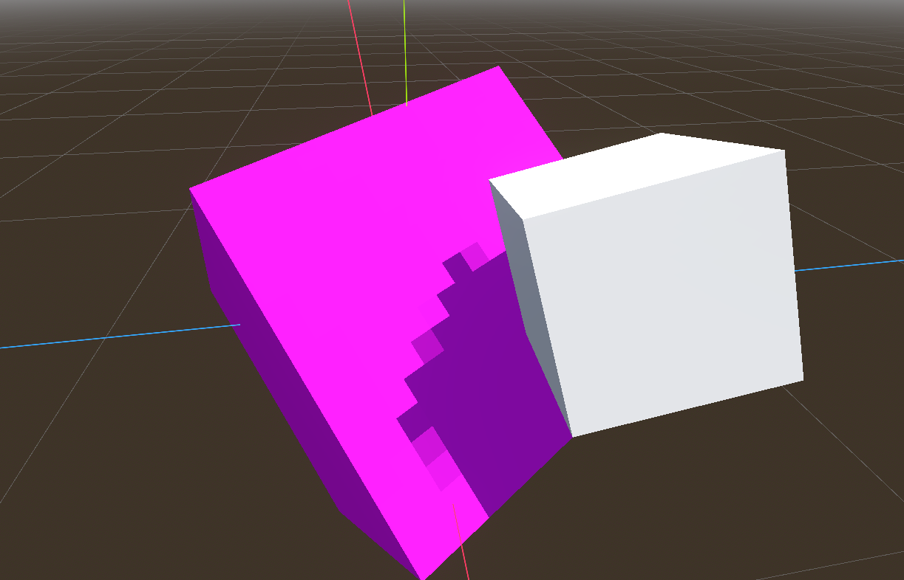

# 27 September 2024 - Lighting is final!
[&lt;&lt;&lt; Previous Post](../08/03.md)
[Next Post &gt;&gt;&gt;](../11/05.md)
 
***

&nbsp;&nbsp;I went on a bit of a hiatus for a while as I focused on other stuff.

&nbsp;&nbsp;This one is short: Remember that old lighting bug when I added pixel shadows? The one where it created weird triangle artifacts? **That bug is no more!**

&nbsp;&nbsp;With some fancy math (creating a 3x3 rotation matrix from the normal, binormal, and tangent vectors of the face being rendered) I was able to properly rotate the shadow projection in 3D space to align it to the surface.

&nbsp;&nbsp;If that makes zero sense to you, here's a before/after that should make more sense:

<flex>
{width=49%}
{width=49%}
</flex>

