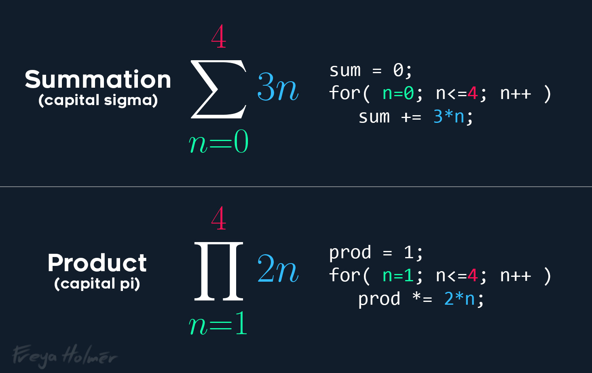

# 16 November 2024 - We're going to have to use ... *math!*
<span style="float:left">[&lt;&lt;&lt; Previous Post](../11/13.md)</span>
<span style="float:right">[Next Post &gt;&gt;&gt;](../11/18.md)</span>
<br/>
***

!!! tip "This is a technical post!"
    I'll be using some language that might not be easily understood by people who don't enjoy their maths and programming.

&nbsp;&nbsp;Today I had to update a complex numeric type that I use for computing values based on universal constants. This type is called `BigDecimal` and is an analogue to C#'s `System.Numerics.BigInteger` type combined with `System.Decimal` to support fractions well out of range of what even `double` or `decimal` can muster.

&nbsp;&nbsp;Turns out, telling the computer how to use a new type of number is *WAY* harder than it sounds. Okay, correction, it's easy if it's an integer type.

&nbsp;&nbsp;The type is implemented based on the work of *Jan Christoph Bernack*, who very graciously released their work into the public domain (I would link it, but I can't seem to find it). When I nabbed the type for use in The Conservatory, I completely rewrote it and also implemented `System.Numerics.INumber<TSelf>` for C#'s generic math feature.

&nbsp;&nbsp;This was a bit of a doozy to get right because I have to support a *lot* of methods. Now, I did that many months ago. Took about a day to get it all done to a satisfactory level.

&nbsp;&nbsp;The thing is, my knowledge of math is a bit lacking. Most of what I know that isn't from school is stuff I learned from random YouTube videos, and connecting the dots from code experience. I can tell you exactly how both a CPU and a GPU works, but I can't do anything beyond matrix multiplication (yet).

&nbsp;&nbsp;For this reason, there were some functions I skipped, because the math was very daunting. I finally got around to adding these methods though, and it was *a journey.*

***

## Implementing Powers: $x^n$

&nbsp;&nbsp;When programming, powers are actually easy to implement, granted $n$ is limited to $n\in\Bbb{Z}^+$ (including 0; that is, 0 and all positive integers).

&nbsp;&nbsp;*All hell broke loose* when I realized that I have to implement $n\in\Bbb{R}$ (all real numbers).

&nbsp;&nbsp;I was not expecting how much of a hassle it would be for me to figure these things out. I guess in part it's because it requires the next three things to be implemented...

## Implementing the Exponential Function: $e^x$

&nbsp;&nbsp;$e$ is Euler's Number, and it is a very special number in math. If you are curious, [3blue1brown has a wonderful video on the topic](https://www.youtube.com/watch?v=m2MIpDrF7Es).

&nbsp;&nbsp;When it comes to a base of $e$, there's a special algorithm for this due to the nature of what makes $e$ so unique.

&nbsp;&nbsp;This method is implemented using:

$$\exp x:=\sum _{k=0}^{\infty }{\frac {x^{k}}{k!}}$$

&nbsp;&nbsp;I actually quite like sigma notation because it makes intuitive sense as a programmer. [Freya Holmér explained this wonderfully on Bluesky](https://bsky.app/profile/freya.bsky.social/post/3lb62ilqhcs26), but for convenience, here's the image:

<center>
{width=75%}
</center>

> <small>**A very fitting note is attached:** *[T]his started a civil war on the former host of twitter and I'm not interested in relitigating that lol [...] yes I'm being reductive, and yes both notations can do more than just this, and yes one of them is more readable than the other to you and that's okay and normal c:*</small>

&nbsp;&nbsp;Now I implemented that math 1:1, like this:

```cs
[Pure]
public static BigDecimal ApproximateExp(BigDecimal exponent, uint iterations = 100) {
	ArgumentOutOfRangeException.ThrowIfNegativeOrZero(iterations);
	// scout_insanity.mp4
	BigDecimal numerator = One;
	BigDecimal denominator = One;
	BigDecimal result = One;
	for (uint k = 1; k <= iterations; k++) {
		numerator *= exponent;
		denominator *= k;
		result += numerator / denominator;
	}
	return result;
}
```

&nbsp;&nbsp;Okay, one down, two to go!

## Implementing the Natural Logarithm: $ln(x)$

&nbsp;&nbsp;The natural log was another big hurdle to get implemented. I did it like so:

$$\frac {1}{\ln(x)} = \frac {2x}{x^2-1}\sqrt{\frac {1}{2}+\frac {x^2+1}{4x}}\sqrt{\frac {1}{2}+\frac {1}{2}\sqrt{\frac {1}{2}+\frac {x^2+1}{4x}}}\ldots$$

&nbsp;&nbsp;To be honest, this one is where I think math kind of lacks a vital concept of "memory", but that's just my programmer brain talking.

&nbsp;&nbsp;I actually think this one is *easier* to understand in code.

&nbsp;&nbsp;For the math nerds out there, **in code, the = sign is temporal (dependent on time)**, effectively the same as the $\Leftarrow$ symbol to refer to assignment of a value.
```cs
int x = 5; // This initializes a new variable x to be equal to 5.
x = x + 7; // Usually written as x += 7 which is a shorthand meaning the same thing.
```

&nbsp;&nbsp;**Or in essence, `x = x + 7` in code is the same as $x \Leftarrow x+7$.**

&nbsp;&nbsp;In my code, I broke the equation into discrete parts. Variables in $\mathtt{\text{typewriter font}}$ indicate a programmatical variable, which are often assigned full names rather than letters.

$$\mathtt{iterativeResultPart} \Leftarrow \sqrt{\frac{1}{2} + \frac{x^2+1}{4x}}$$

$$\mathtt{previousInner} \Leftarrow \mathtt{iterativeResultPart}$$

&nbsp;&nbsp;What I then do is a loop based on a number of iterations. Repeatedly, this statement is evaluated based on a parameter which declares how many times to do so:

$$\mathtt{previousInner} \Leftarrow \sqrt{\frac{1}{2} + \frac{\mathtt{previousInner}}{2}}$$

$$\mathtt{iterativeResultPart} \Leftarrow \mathtt{iterativeResultPart \times previousInner}$$

&nbsp;&nbsp;Then finally, the result is returned as:

$$\frac {2x}{x^2-1} + \mathtt{iterativeResultPart}$$

&nbsp;&nbsp;This achieves the same purpose as the original equation above. This equation actually computes $\frac{1}{ln(x)}$, also.

## Implementing Square Roots: $\sqrt{x}$

&nbsp;&nbsp;This one actually wasn't so bad. It uses a slightly improved technique for how to manually find a square root by hand, same method people in school learn. Nothing really special here.

&nbsp;&nbsp;The "slight improvements" allow it to make better incremental jumps in each guess.

## And now it's done!

&nbsp;&nbsp;With these, I can use a rule to evaluate $x^n$. The rule states these two are the same exact thing:

$$x^n = e^{ln(x^n)}$$

&nbsp;&nbsp;The natural logarithm there can be rearranged to remove that exponent from $x$. These two are the exact same thing as well...

$$ln(x^n) = \text{n }ln(x)$$

&nbsp;&nbsp;So using this, we can rearrange the equation just a bit more, and...

$$x^n = e^{\text{n }ln(x)}$$

&nbsp;&nbsp;And that's something I can work with using the functions I created. We did it!