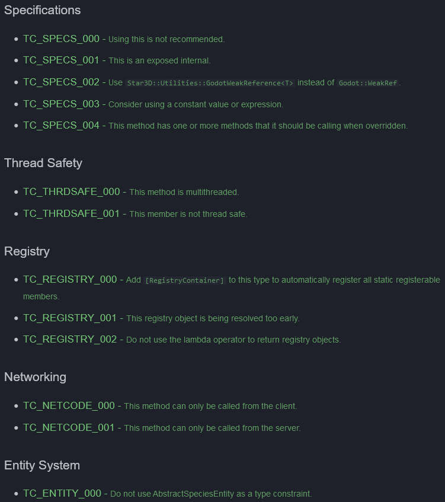
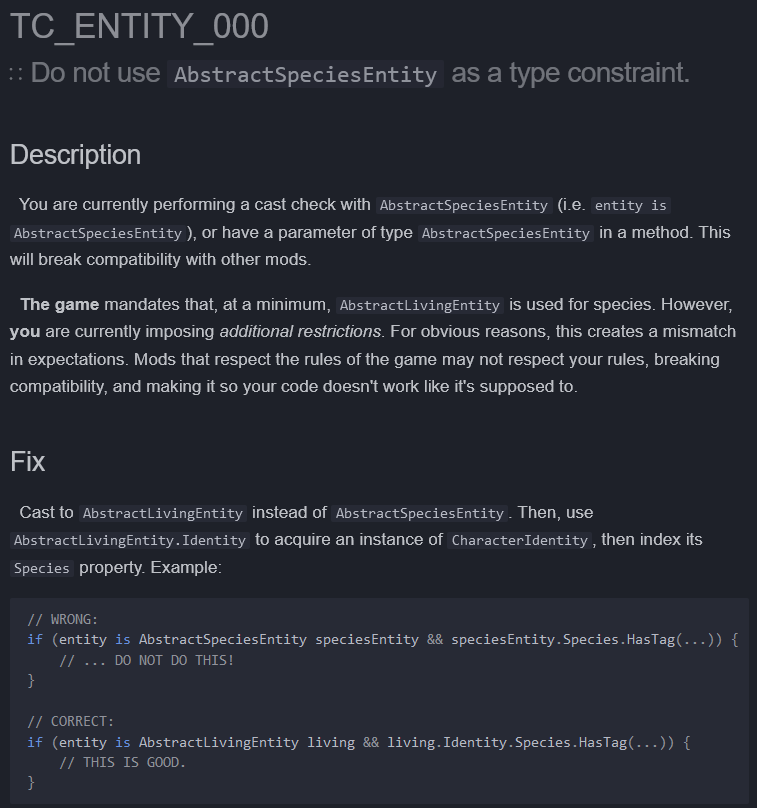

# 1 January 2025 - The Conservatory Analysis Tools
[&lt;&lt;&lt; Previous Post](../../2024/12/24.md)
<!--[Next Post &gt;&gt;&gt;]()-->
You're on the latest post!
 
***

&nbsp;&nbsp;Before I start this blog post, obligatory messages: Happy new year! I can't believe it's already 2007.

&nbsp;&nbsp;Anyway... It's another blog post about the analyzer - but rest assured, this time, **I have good news.**

&nbsp;&nbsp;As a brief recap, I wanted to make a Roslyn Analyzer + Code Fix combo for my future modders. *Roslyn* is the system that compiles C# for .NET, and analyzers are tools that operate within this space to create compiler warnings and errors.

&nbsp;&nbsp;Using this, I have created many special, custom diagnostics that show up in modded code (or even *my* code!) for The Conservatory.

&nbsp;&nbsp;Here's some little examples of the helpful redirects the tool gives you:

&nbsp;&nbsp;And as a matter of fact, there's a lot of little helpful goodies in here. **You may have noticed each warning is a clickable link.** That's right - even the diagnostics are documented! 

&nbsp;&nbsp;**You may need to press on the following images to zoom in.**

<flex>
{width=45%}
{width=45%}
</flex>

&nbsp;&nbsp;You can see there's a lot of assorted diagnostics that make sure your code stays functional and mistakes are caught before you get into your testing phase. Every page for every diagnostic has as much detail as it needs to make it abundantly clear exactly why a warning/error is raised, and how to fix it, including multiple ways to fix it if the fix is not straightforward.

&nbsp;&nbsp;To crank this up to 11, though, I will add that the code keywords in that second image for the game types `AbstractLivingEntity` and `AbstractSpeciesEntity` will be clickable links in the future, leading to the game's online documentation. So if you were going to ask *"What's the difference"*, that question is answered too via the game's documentation.[^disp:About&#x20;AbstractSpeciesEntity&#x3F;]

&nbsp;&nbsp;As you can see, my give-a-shit for my modding community is not broken, and my field of fucks is most certainly not barren.

[^disp:About&#x20;AbstractSpeciesEntity&#x3F;]: `AbstractSpeciesEntity` is a convenience layer that shunts in a call to `EntityValidation.AssertSpeciesIs(...)` into the constructor. This way, you can't construct an `AbstractGaianEntity` (which extends this type) using `Species.Novan`, for example. This will raise an exception.  This is an entirely optional convenience layer however, and it's more than valid to skip it and just call the assertion yourself. This is why it's not a good idea to limit by `AbstractSpeciesEntity` - an entity may not even be using it in the first place!