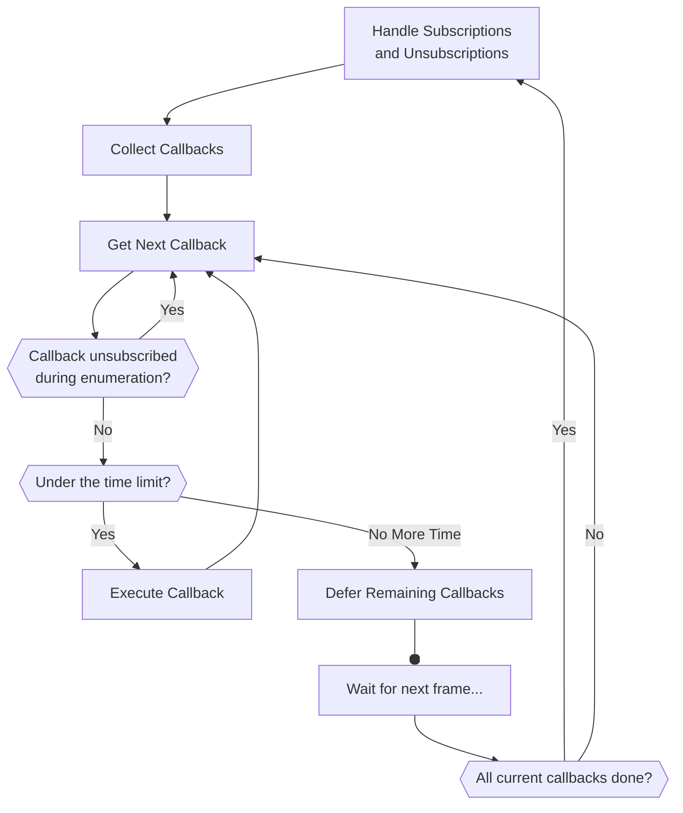

# 8 May 2025 - The Road to Beta Continues
<span style="float:left">[&lt;&lt;&lt; Previous Post](../04/22.md)</span>
<span style="float:right">[Next Post &gt;&gt;&gt;](../05/21.md)</span>
<br/>
***

&nbsp;&nbsp;A ***lot*** has happened in the past month; development has hit another super-surge and a bunch of progress has been made. I just want to outline what's gone on this past month, as well as my plans for the immediate future.

&nbsp;&nbsp;This blog post is so long that it officially qualifies for the status of ***T H I C C .***

## Entities no longer use nodes

&nbsp;&nbsp;In the last blog post I went over how I removed nodes from the terrain system and got an absurd performance boost out of it. This change has been translated to entities. Unfortunately, it's not so straightforward here. There had to be some odd compromises and tricks to get it all to work nicely.

### The complexity of `AbstractEntity`

&nbsp;&nbsp;The world is pretty simple compared to entities. Translating the game's `StatefulVoxel` struct into geometry and physics objects has been done and is complete; the terrain system works exactly as it should and is able to handle different render and physics materials seamlessly.

&nbsp;&nbsp;When it comes to entities, however, the story is different. Entities are not so well defined. An entity is a very abstract concept to the game, as it's basically "a thing that exists in the world that does stuff". If that sounds vague, it's because it is. This makes things difficult.

&nbsp;&nbsp;The first challenge to face is how to handle physics. Entities were, prior to this change, a type extending `CharacterBody3D` (Godot's kinematic physics object designed specifically for character, moreso player, movement). Getting rid of this type was a hard choice because it's *really good* at what it does. Now, `AbstractEntity` simply tracks a reference to an `Rid` representing a low level physics body. This has several benefits, but to name a few:

* Certain physical motion types require specific node setups that are hard to enforce (i.e. `RigidLinear` bodies, which do not worry about angular momentum or rotation, dramatically simplifying simulation). This can now be directly set as a property of the entity.
* Useful, controllable types for relevant collisions. Some entities are static, some are kinematic, and some are rigid. `CharacterBody3D` can emulate this, but if I want truly perfect control, using a low level physics object allows me to mutate it as needed on the fly. This is incredibly powerful.

&nbsp;&nbsp;This is well and good, but there's just one *tiny* problem: It's hard for me and modders to make character models that aren't node-based. Working with them in the Godot editor requires the use of nodes, otherwise editor features don't apply. This means that they still need nodes.

&nbsp;&nbsp;Thankfully, I am aware of this problem. For this reason, modders will still create characters and items in Godot as scene resources. The game handles all the hard parts and worrying about where it goes in the scene tree. You just make the thing and come up with how it works. I make it work with the game itself.

&nbsp;&nbsp;The main benefit to this change is again the lack of thread limits and scene tree access, just as it was for terrain. In particular here, though, it's object disposal that's much easier. Because entities are no longer bound by the scene tree, I can properly schedule their creation and deletion. It's okay if the physical character model lingers for a frame for a deferred deletion, for example. What matters is that the entity is properly marked as invalid and destroyed *immediately* and on my command. Previously, this was a problem when unloading worlds because the unload operation would be blocked by the deletion of entities and other objects like terrain, causing the game to hang on an "unloading" screen.

## Expensive Ticks

&nbsp;&nbsp;One of the immediate concerns that came from entities no longer being nodes is the revocation of their `_Process` and `_PhysicsProcess` callbacks. These were pretty useful, and out of necessity I ended up creating something much better: Enter **expensive ticks.**

&nbsp;&nbsp;The game's scene tree type, `FabricOfReality` - very avidly named, I know - contains C# events that fire on `Process` and `PhysicsProcess` respectively. This is all well and good; they run per frame and at the same pace as the game. **There's just one issue.** If you've played Minecraft on a laggy server, you know of the woes that is entity lag. Hitting a zombie only for it to do nothing and then you take damage from out of nowhere. It sucks.

&nbsp;&nbsp;Continuing with the example, Minecraft tried to mitigate this with a slow tick rate of 20/sec. This is honestly a perfectly valid solution as it gives entities a comparatively long time to compute things without slowing down the server. It has its limits though (as mentioned before), and so expensive ticks are an experimental resolution to this problem. 

### Okay, just get to the point, what do they *do?*

&nbsp;&nbsp;These events also run on `Process` and `PhysicsProcess` just like our ordinary tick events; that means *per frame*. Every time an expensive tick is ready to be sent out, all pending callbacks are collected into a queue. Then, this queue is processed one by one, with the game closely monitoring how long it takes to run all that code.

&nbsp;&nbsp;When it runs these callbacks, it does so until the time elapsed passes a limit. This limit is 4ms by default, but exists in engine configs so you can change it. Once that 4ms is surpassed, the invocation list is metaphorically "put on the backburner"; the rest of the frame is allowed to continue. Then, on the next frame, we continue where we last left off in that invocation list. This process repeats until we hit the end.

<center>



</center>

&nbsp;&nbsp;The benefit to this, and arguably its failure as well depending on perspective, is that this *reduces the frequency* of updates. You can think of it as a way to implement dynamic tick rate. If the game would start lagging too much, the tick rate is purposely reduced to compensate, and things are designed around that fact.

&nbsp;&nbsp;The only issue this raises is that entities will simulate slower when we start throttling time. Instead of the entities visibly lagging, though, their processes will instead slow down. Their processing of the world around them will suffer, but not the actual performance of the entity itself.

&nbsp;&nbsp;By slowing down entity processing to salvage everything else, we solve that aforementioned "laggy zombie" problem. If you hit a laggy entity in *The Conservatory*, it will take damage as soon as you hit it (unless you are ***really*** lagging, like 2 FPS type shit). In exchange, it will react to changes in the environment more slowly, as if it were half asleep or distracted. The important thing is that the things you do and the actions you take still apply in a timely manner.

&nbsp;&nbsp;The major thing you are probably asking is "doesn't that put the player at an advantage if the game is overwhelmed"? To which the answer is a very frank "yes". Yes it does. I think this is the right choice though, because it sucks when you hit a monster and nothing happens, and this fixes that problem. Would you rather the monsters be at an advantage just because you lag?

## Harmony

&nbsp;&nbsp;In my continuing efforts to ensure the game is moddable in as easy a way as possible, one realization hit: People are going to need to change the game's vanilla code. Tools exist to do this, but my main worry is *what if people pick different tools?* The last thing I need on my hands is a modding community torn between mods that use *System A* and *System B*, so as the developer I have asserted my authority and mandated that we use *Harmony* - which has an even more perfect name than `FabricOfReality` does - as the patching framework.

&nbsp;&nbsp;If you have ever modded a Unity game, you already know what Harmony is. MelonLoader and BepInEx both use it despite being different loaders, and for good reason - Harmony is powerful.

&nbsp;&nbsp;If you aren't familiar with Harmony, it's a runtime code modification framework for Mono and .NET that allows you to patch code during runtime. This is outstanding for mods because it means you can package all of the changes you need to make to the game's code in your mod, and apply it without having to share edited game code (which would violate copyright laws). Moreover, Harmony was designed by a modder (one? more than one?), for modders. Its design pattern was made with mod compatibility in mind, making it the perfect tool for the job.

&nbsp;&nbsp;Alongside the addition of Harmony as an included library, the game's vanilla code has also been upgraded to use it. This includes a couple of changes which I cover in the next section.

### Improved Error Logging

&nbsp;&nbsp;The Conservatory has included a system to log crashes since its creation, which includes a really nice pretty-printer for exceptions. Here's a crash log from development when I broke asset loading:

```log
https://youtu.be/dzMq5_thk4o?t=802

Crash Time: Saturday, April 19, 2025 at 8:33:17 PM GMT+0
Context: Executing Internal Main Loop

Game Modification Status: Vanilla; No Mods

BEGIN CRASH DUMP ::
[System.TypeInitializationException]: The type initializer for 'Star3D.Render.CommonMaterials' threw an exception.
│╠In Star3D.Render.CommonMaterials::get_DefaultOpaqueTerrainMaterial at IL+0x0000
│╠In Star3D.Render.Atlas.TerrainTextureAtlas::SetParameterOnAllTerrainShaders at IL+0x0001
│╠In Star3D.Render.Atlas.TerrainTextureAtlas::ApplyAtlasesToShader at IL+0x001B
│╠In Star3D.Render.Atlas.TerrainTextureAtlas+<GenerateAtlases>d__39::MoveNext at IL+0x0B3C
│╠In Star3D.FabricOfReality+<Startup>d__53::MoveNext at IL+0x06FA
│╠In Star3D.Async.Coroutine::Resume on line 95
│╠In Star3D.FabricOfReality::ContinueStartup on line 190
│╚In Star3D.FabricOfReality::_Process on line 189
└[System.IO.FileNotFoundException]: No such file with ID vanilla:atlased_terrain_translucent (File: vanilla:atlased_terrain_translucent (resolved using GameRootPathifier[RootFolderName=materials] into assets/vanilla/materials/atlased_terrain_translucent.tres))
  ╠In Star3D.IO.StarFileSystem::GetAssetFromAll at IL+0x00AD
  ╠In Star3D.IO.StarFileSystem::GetResourceFromAll at IL+0x0001
  ╚In Star3D.Render.CommonMaterials::.cctor on line 19
```

&nbsp;&nbsp;With the addition of Harmony, this tool has been further improved. It will now relay information about patches to specific methods that were part of the stack trace, as shown in an edited example below:

```log
BEGIN CRASH DUMP ::
[System.TypeInitializationException]: The type initializer for 'Star3D.Render.CommonMaterials' threw an exception.
...
│╠In Patch ExampleMod.Render.Atlas.TerrainTextureAtlasPatches::OnApplyingAtlasesToShader at IL+0x001B
│║   ┣Original Method: Star3D.Render.Atlas.TerrainTextureAtlas::ApplyAtlasesToShader
│║   ┗Harmony ID: The Example Mod (ID: examplemod)
│╠In Star3D.Render.Atlas.TerrainTextureAtlas+<GenerateAtlases>d__39::MoveNext at IL+0x0B3C
...
```

&nbsp;&nbsp;As you can see, the log now includes the patch method with additional information. This information includes the original method that the patch was applied to, and the Harmony instance that was responsible for making that patch. This should make it *significantly* easier to debug mods that do code patches on the fly, as we can see who is responsible for what rather than by taking a guess from the stack trace (patched stack traces can get pretty messy, if you didn't know).

***

## Closing Thoughts

&nbsp;&nbsp;All around, work has been incredibly swift as of late, and I am excited to announce that I am growing ever closer to a point where the game is properly playable. A lot of the time spent developing these past few months has been core framework upgrades to facilitate everything that I need for the game to be at its best. This has required rethinking a lot of old systems and adapting them to fit new goals.

&nbsp;&nbsp;I'll do everything I can to keep you all up to date, but please note that I expect blog posts to stay fairly sparse during this critical time. As things level out, they may be come more frequent, but for the time being, this once-a-month schedule seems to be how it'll go for the foreseeable future.

&nbsp;&nbsp;Thanks for reading!