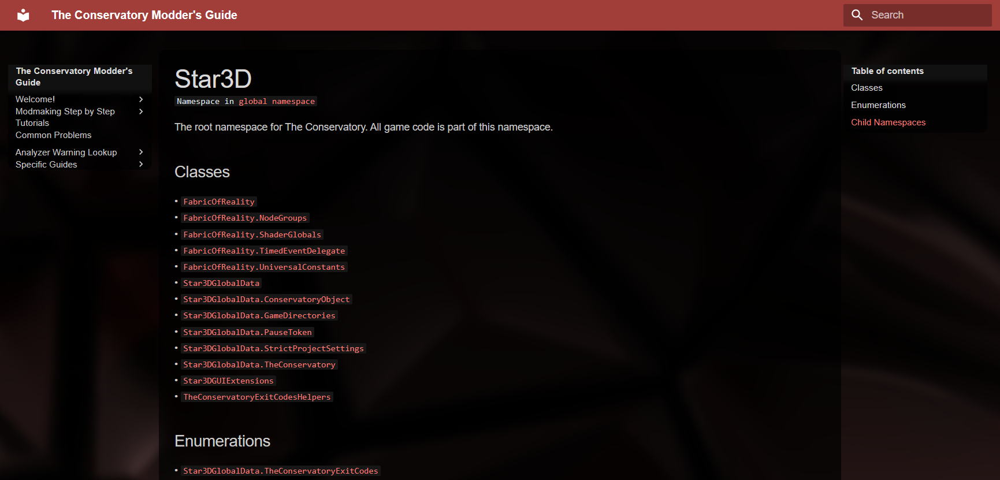
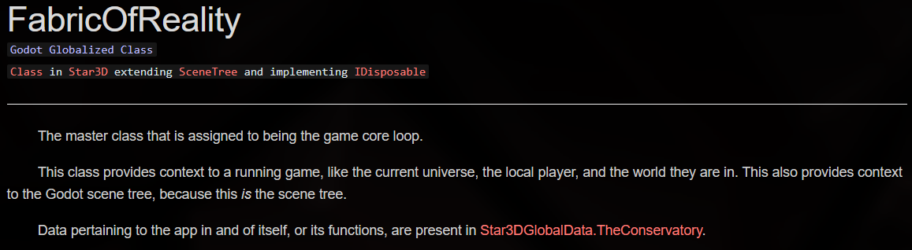
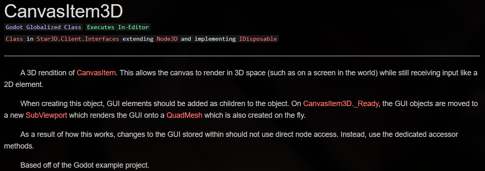
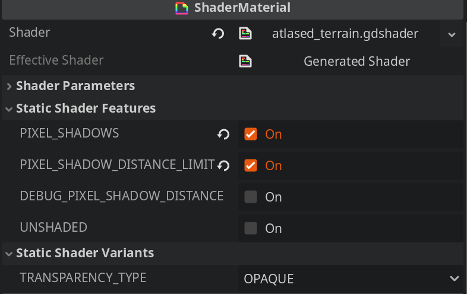
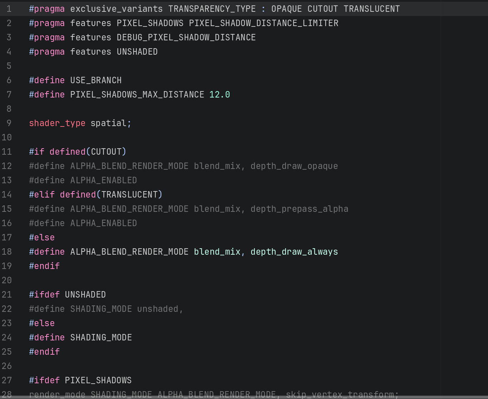

# 22 June 2025 - Blog Fixes, Progress Report
[&lt;&lt;&lt; Previous Post](../06/04.md)
<!--[Next Post &gt;&gt;&gt;]()-->
You're on the latest post!
 
***

&nbsp;&nbsp;Hi everyone. Once again I've come to give you a teeny progress report. Things have been in a strange bit of flux and I have been slowing down work to ease my mind a bit. But there's still some new stuff.

## Blog Fixes

&nbsp;&nbsp;As you may have noticed, the blog is even wider than it was before. This was originally part of a fix for mobile not showing the screen at full width, but ultimately I decided it just looked better in general to have the blog be at full width.

&nbsp;&nbsp;I also fixed the nav-bar on mobile, the header showing the current category of pages is no longer white, and by extension the text is now properly visible.

## New Mod Documentation

&nbsp;&nbsp;The game isn't out of course, and so this is largely internal, but I have recently done a bunch of side work for the modders out there: The Conservatory now ships with online documentation **using the theme of this website.**

&nbsp;&nbsp;For the non-technical people out there, Visual Studio (not VS Code, just plain VS) allows me to export certain special types of comments in my code. This is documentation; a description of the code and other relevant information designed to be read by people. It's one of the most important parts of any codebase because it tells people *how to use it.* You can imagine why this is useful for modders!

&nbsp;&nbsp;Certain special tools allow converting these comments into a website for people to use.

### Previous Context

&nbsp;&nbsp;Prior to this moment, I was using Doxygen. This is a tool that takes the data of those documentation comments and turns it into HTML. This worked mostly okay, but I had some qualms with it. It looks weird (to me), feels unorganized, and also had no context to the actual code that was being documented so a lot of links and stuff were broken.

&nbsp;&nbsp;After getting upset at Doxygen, I looked into Sandcastle, ReadTheDocs, and DocFX, all of which were not satisfying to me. My older sister suggested Statiq, but this wasn't ideal either.

&nbsp;&nbsp;So, in typical programmer fashion, the extreme option became appealing: Do it myself. Now I will say - this was **way** more complex than I thought it would be, like ridiculously complicated. But I was determined to make it work **exactly** how I wanted to.

### The New Tool

&nbsp;&nbsp;I think the most powerful part of my custom tool is the fact that it actually loads the game's core .DLL file (the code) as it generates documentation. This allows it to actually go in and inspect the exact details of my code that would never be exported as part of its documentation. The ability to look at this precise information makes documentation feel a lot better because it strips away all ambiguity. 

&nbsp;&nbsp;Among its primary features includes...

* The ability to display admonitions.

!!! note "This is an admonition"
    You'll see these all over my website.

* The ability to read special attributes that contain messages to show to the programmer:
    * `[IllAdvised]` is an internal metadata tag used to tell modders that while a method is usable, there's often a better alternative, or what they are doing is unconventional and will *probably* break things.
    * `[ExposedInternal]` is another internal metadata tag used to tell modders that the piece of code they are using was originally something locked down to vanilla code only (but which was willingly exposed to them), so they should try to see if there's a "proper" way to do what they want before continuing.
    * `[OnlyAvailableOn]` marks where some code can be used with respect to multiplayer, such as authority only, or server only, code.
* The ability to observe the fine details of method parameters. Basic tools can see if a parameter uses `ref`, but my tool can see:
    * `in`/`out`
    * `ref readonly`
    * `scoped ref`/`scoped ref readonly`
* The ability to see access modifiers like `public`, `private`, etc.

&nbsp;&nbsp;And of course, the most important tool is the ability for me to have precise control over how exactly it displays to you with the theming and whatnot. Here's some pictures of the pages I made:

<flex style="display:block">
{width=49%}
{width=49%}
{width=49%}
{width=49%}
</flex>

## Progress Report

### New Engine Feature: `ShapeCast3DDirect`

&nbsp;&nbsp;If you are curious, a shape cast is like a ray cast, but it instead checks for colliders that intersect with a shape at a specific position in space.

&nbsp;&nbsp;Like many engines, Godot allows both *ray* casting and *shape* casting. Rays are line segments used commonly for hitscan, and shapes are used for collider queries. Until now, parity with raycasting and shapecasting was broken because there was no `ShapeCast3DDirect` as a counterpart to the `RayCast3DDirect` type I added last engine update.

&nbsp;&nbsp;I'll spare the details, because the reason this exists as well as its design style are exactly the same as they were for `RayCast3DDirect`.

### New Engine Feature: `features` and `exclusive_variants` in shaders

&nbsp;&nbsp;This is the addition of statically-compiled shader variants to *The Conservatory*. This allows shaders to get rid of `if` statements, which are not good for GPU performance, by turning these statements into *static branches*. Static branches are special branches that, rather than checking while the code is running, actually check *before* the code runs. This does limit where they can be used to what are called "compile-time constants" (that is, information you know before even using the code in the first place). But, when you can leverage them, the performance gains are huge.

&nbsp;&nbsp;This includes a whole editor widget to customize them, as shown below:

{width=33%}
{width=33%}

### Physics Engine API Upgrade

&nbsp;&nbsp;A slight API change was done to the physics server which allows *getting* if a shape is disabled on a body or area. This API is not normally included (only a means of setting the value), so I added it myself. Any GDExtensions you adapt for The Conservatory which affect or use the physics server will need to implement this method.

### Entities and Chunk Loading

&nbsp;&nbsp;This detail is largely internal so I'll keep it short. Entities started out with their own value indicating how many chunks around them they would load. This no longer exists; instead, it's part of the entity *identity* (the type describing what an entity is conceptually).

&nbsp;&nbsp;This has to do with the de-noding (see the blog post before the previous one) and physics engine trickery. Basically, to optimize the way entities work in the game, a master type called the "Entity Marshal" uses this to determine which entities it should keep track of for chunk loading.

&nbsp;&nbsp;Entities which are classified as purely static (they can't move, not even through being teleported) are not tracked because their position will never change, so there's no need to. In the old system, it had to double check anyway to make sure their physics mode wasn't changed unexpectedly, which added code complexity and a bunch of extra work. This is no longer supported; once you declare an entity as static or teleport-only or physically simulated, it *stays* that way permanently.

## Closing Thoughts

&nbsp;&nbsp;Not a lot has gone on, yet at the same time a huge amount has been going on. This is kind of a nothing-burger of a blog post, I know, but I just felt the need to keep you all up to date.