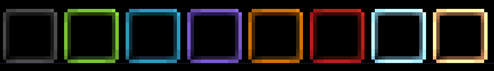
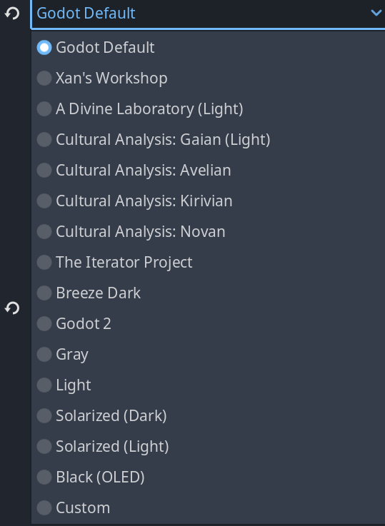
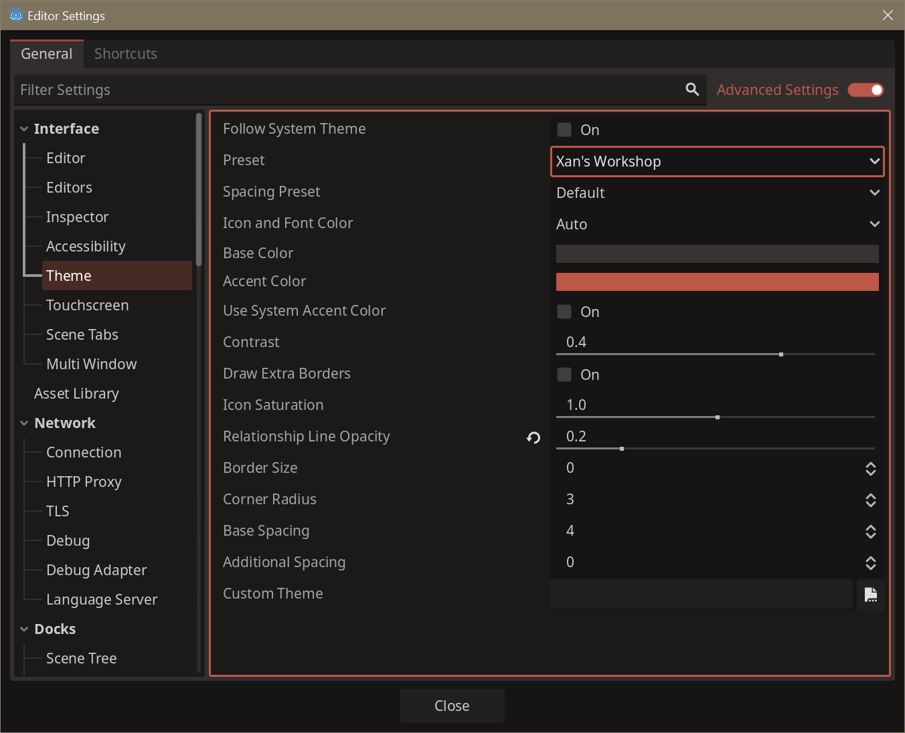
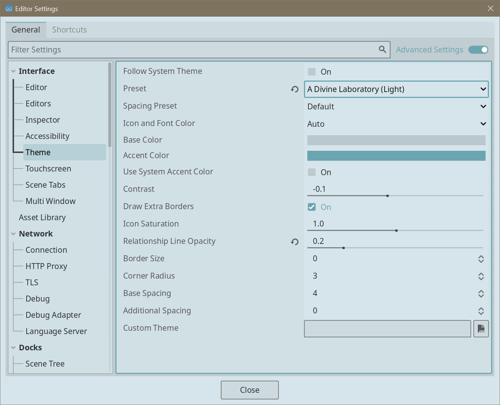
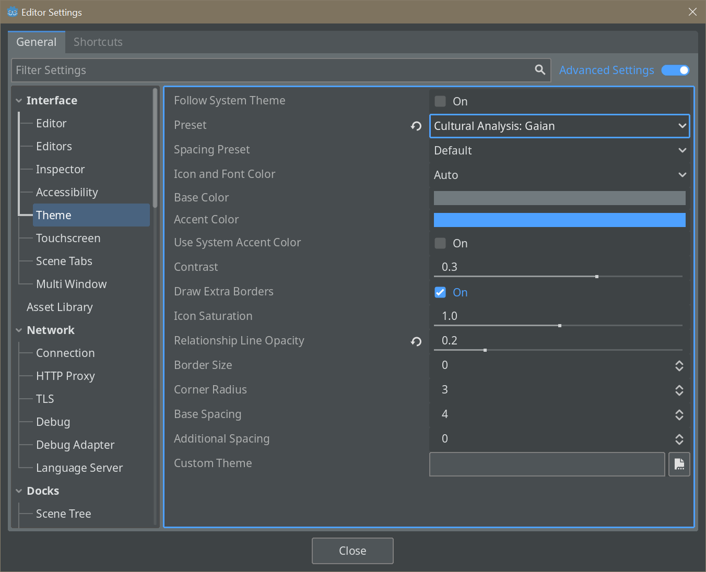
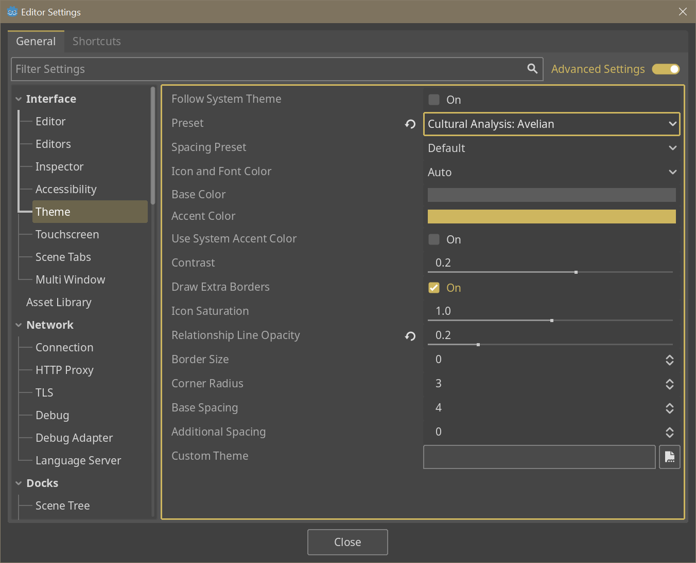
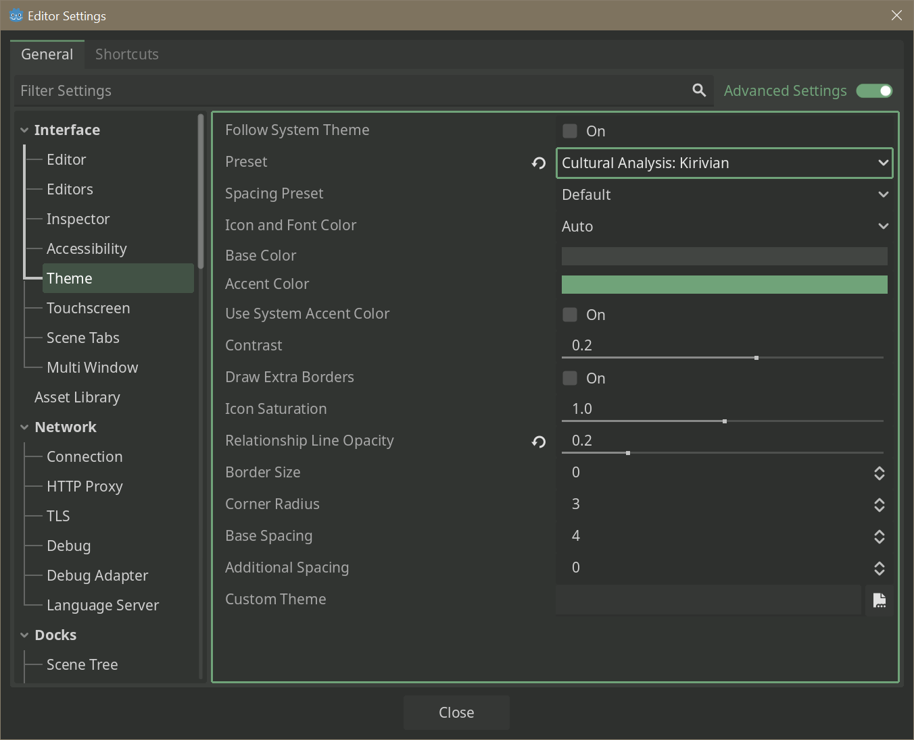
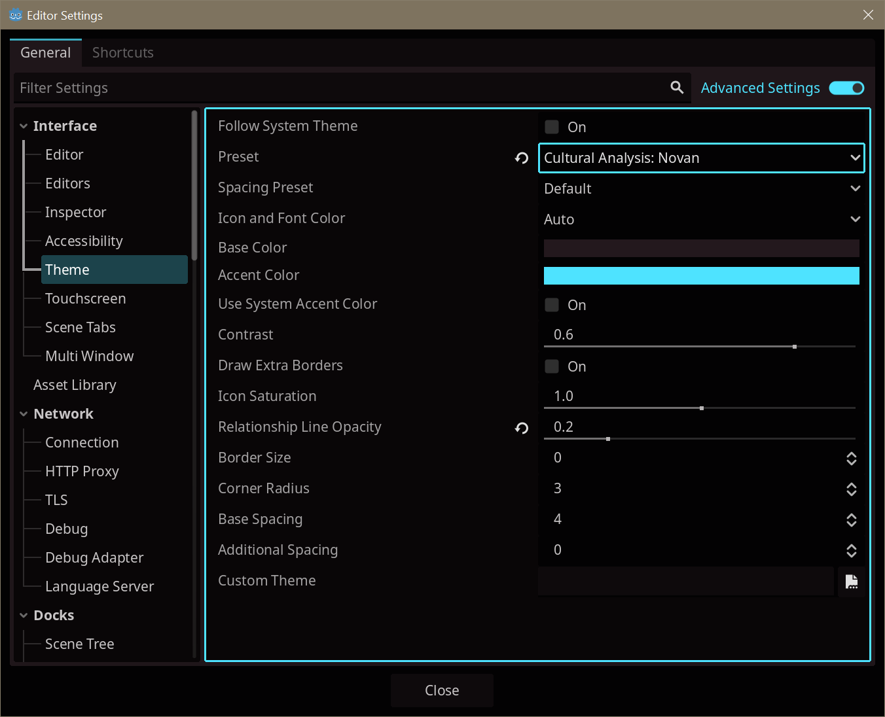
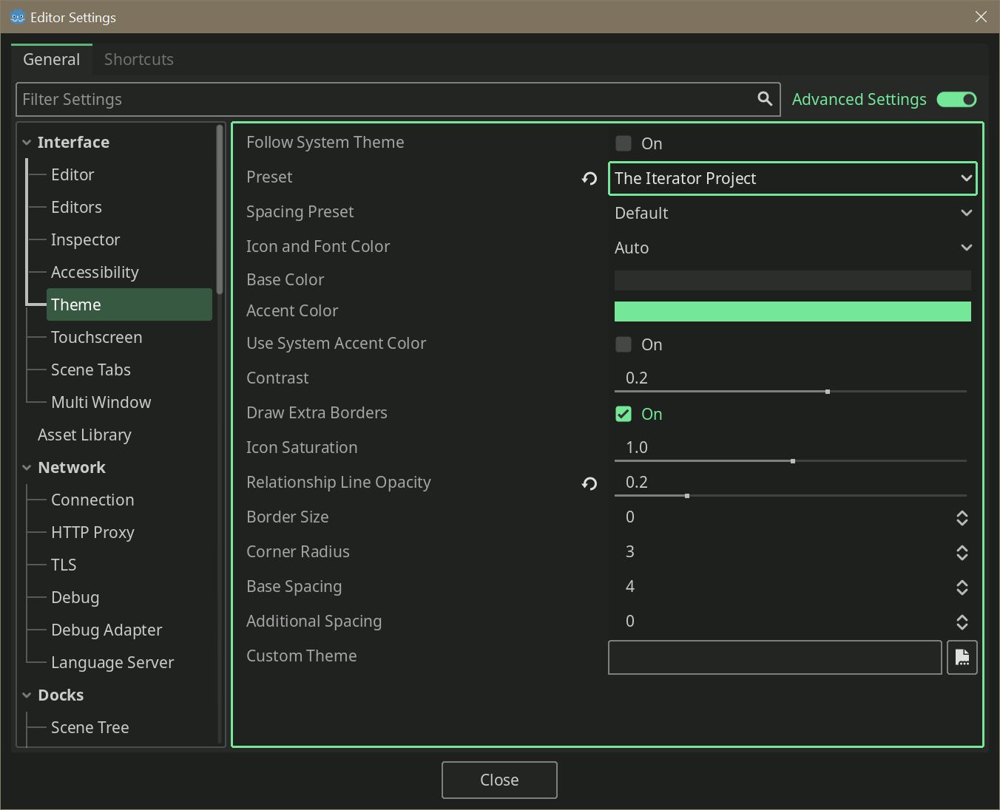

# 10 August 2025 - The First Art Pass
[&lt;&lt;&lt; Previous Post](../06/22.md)
<!--[Next Post &gt;&gt;&gt;]()-->
You're on the latest post!
 
***

&nbsp;&nbsp;It has been *a while* since my last post. I've kind of tried to maintain a silent monthly posting schedule but I've been so occupied with both myself and the project that it slipped by without me noticing.

## The Art Pass Begins

&nbsp;&nbsp;As you may have noticed, this blog historically hasn't been big on pictures of the actual game. This is a bit of a running theme, but it's very much intentional, as basically all this time has been spent grayboxing and prototyping the vast systems involved with the game (and battling with my mental disabilities, but that's a topic for another time. I am well, don't worry!)

&nbsp;&nbsp;However, now, I am beginning the art pass. The first art pass of a game's development is typically when the real transition from Alpha to Beta occurs. Things are starting to settle in and become more concrete, enough to the point where designing special art assets just for them begins to make sense. This is very exciting, and for the first time in a long time, **I have things to show you!**

### Item Rarities

&nbsp;&nbsp;One detail is that *The Conservatory* is heavily inspired by RPGs where items have rarities associated with them, different quality levels. This follows the *de facto* standard of "Common/Uncommon/Rare/Epic/Legendary" that you are most certainly familiar with if you have played any game that has rarity levels in it. I have taken the liberty of adding three additional tiers.

&nbsp;&nbsp;To describe these items, a frame has been created for these items in the inventory, like so:

{width=50%}

The rarities shown are as follows:

| Rarity | Color | Description |
| :------ | :----- | :----------- |
| Common | Dark Gray | Common is the default tier and represents the most unremarkable level of rarity. Items in this tier are, as the name implies, quite common. Most natural materials that are easily accessible are here. |
| Uncommon | Green | Uncommon items are marginally more interesting than their Common counterparts, still fairly common but rare enough to warrant having their own tier. Processed materials will often have this tier, like ingots or constructed objects, as will certain ores. Some alloys and synthetic materials (like plastic) will have this tier. |
| Rare | Blue | Rare items are where items begin to become particularly notable. These items are not easy to find, but not difficult to find either. They are right in the middle. Complex objects like circuitry and most equipment will have this tier. |
| Epic | Violet | Epic items are quite rare and often very special when you do find them. They also represent difficult to create objects, like advanced synthetic fibers (especially carbon fiber and other related substances) or advanced microcircuitry. These items are pristine. |
| Legendary | Orange | Legendary items are the hardest to come across among the standard rarities, representing items rare enough to, as the name implies, be subjects of legend. Synthetic materials that use this tier are things like quantum computers, warp drives, and teleporters. The top of the top lives in this tier. | 
| Exotic | Red | Exotic items are not often used in vanilla, and are more of a stopgap to create a common, shared tier for modders to use when they want rarer-than-legendary items. A good possible description is that these items *would* be unique if not for the fact that they can be found in generated locations or as drops, even if extremely rarely. |
| Unique | Celestine Blue | Unique items are self-explanatory. This is an item where a hard-coded, intentionally chosen number exists in the entire universe. Unlike all other rarities, these items cannot be farmed, found at random (\* as part of generic procedural generation), or created. |
| Divine | Gold | Divine items are reserved specifically for the single purpose of being [The Conservator](../../other-lore/characters/conservator.md)'s personal belongings. This also includes creative versions of items, like power supplies which have a maximum supply rate of infinity, mining lasers that instantly break any material, or weapons that deal infinite damage. |

&nbsp;&nbsp;In particular, I had reservations against adding *Exotic* tier at first, since the last thing I wanted to do was [pull a Trove](https://trove.fandom.com/wiki/Rarity) (n.b. this link goes to Fandom) where so many rarities are added that the lower ones become meaningless. <small>Back in my day, finding a rainbow item was a thing to celebrate. Shadow didn't even exist yet! Beta sure was a different time...</small>

### The Kirivians

&nbsp;&nbsp;The Kirivians have now received proper concept art done by [Still-Icarus](https://bsky.app/profile/still-icarus.bsky.social). Here's the most recent example (there's more than this but you don't get to see or read it yet).

{width=50%}

&nbsp;&nbsp;A lot of you are probably wondering "Will you go with a low poly model style? Voxel based?" to which I very avidly answer "good question", because I haven't decided yet. I'm making *both* right now to see what looks better, but I have been consistently thinking of going low poly. When I say "low poly" I don't mean PSX style, I think that style is getting a bit oversaturated in recent years among indie titles. Basically, I don't want intentionally visible polygons, but I don't want turbo quality either.

### Languages!

&nbsp;&nbsp;There's a special flavor of nerd out there that loves languages and worldbuilding, and boy do I have a feast for you. Currently, there are unique fonts for each of the four main playable races, as well as some easter eggs/additional references to other languages!

![Several lines of text. The first line says "Gaian 12px font". The remaining lines of text are all in other languages. The Kirivian language, on the second line, is written using something called "sitelen pona", the custom, picture-based writing style for a language called <em>toki pona</em>. The Avelian language, on the third line, is composed of many rounded line segments. Its formfactor is mostly square, appearing drawn. The Novan language, on the fourth line, is completely square, and uses a 3x3 grid of square dots connected with lines for each letter. The fifth line is using Avali Scratch, which is composed of straight lines in varying lengths and orientations. The sixth and final line uses somthing called Akolouthos. Unlike traditional text, it is square, resembling something like a QR code with some parts black and others white.](./img/fonts.png)

<small>\* I plan to tweak the *sitelen pona* font because some glyphs, particularly 󱥔, are not centered. The larger font sizes also look less than ideal. Each font has three sizes to maximize the amount of usable sizes in game: 12px, 18px, and 24px.</small>

The languages are as follows.

| Name | Species | Notes | Type |
| --- | --- | --- | --- |
| Latin-base | Gaians | This is the font used for the Human race and so it is just basic text. The game uses this font in all places, lore-related or not. | Plain English! |
| sitelen pona | Kirivians | Uniquely, this is a [real life language called "toki pona"](https://tokipona.org) **(meaning it WAS NOT made for The Conservatory, and is not my work)!** Specifically, sitelen pona is an alternate means of writing text in this language. Each symbol corresponds to one word. This says <em>"sitelen pona kepeken nasin sitelen suli luka luka tu"</em>, in this case meaning "sitelen pona written with a size 12 font." | Logographic, Conlang |
| Emblematic Print | Avelian | Avelians make heavy use of stone and metal in their construction, using impressions on clay or heated metal to write text, giving it a distinct style somewhere between stamped and brushed. | Substitution Script\* |
| Photosequence | Novan | The Novan species does not communicate with sounds, but rather with light. Ticks thus trace out distinct flashing patterns rather than sounds. | Substitution Script\* |
| Scratch | Avali | **Not made by me! I only drew the font shown above, but I did not make the language.** This is included as a bit of a shoutout to the Avali community, who is cemented primarily in *Starbound*. Given that this game takes much inspiration from Starbound, and that a lot of my friends are Avali, it made sense to include this out of the box for any aspiring modders looking to add space chickens into the game. | Substitution Script |
| Akolouthos | Synths and Robots | **Designed by *[Antiheat](https://bsky.app/profile/antiheat.bsky.social)* (not made by me! I only drew the font shown above, but I did not make the language)**, Akolouthos is a systemically readable, QR-code-adjacent, text-only method of print that makes it easier for robotic life and other machines to read text in bulk in a more visually deterministic fashion. | Substitution Script |

<small>\* This <em>MIGHT</em> get a pseudo-conlang (think what Bethesda does for their languages) or a basic randomized/unpatterned sequence of sounds (think No Man's Sky). This is a huge amount of work and simply isn't worth it right now! Rest assured, the capability will be added ahead of time so modders can use it too.</small>

&nbsp;&nbsp;Another footnote with fonts is that I include *Fairfax* as the fallback font. This [gargantuan font](https://www.kreativekorp.com/software/fonts/fairfax/) contains just about every Unicode character, and more importantly, implements **UCSUR.** This means that while not natively used in the game, the font is capable of writing in [even more constructed languages](https://www.kreativekorp.com/ucsur/) (including sitelen pona) that are not actually used by the game. But if you ever wanted to reference something in a mod, well...

### Menu Themes

&nbsp;&nbsp;Now that I am doing an art pass, menus are no longer basic rectangles. My skills in pixel art have skyrocketed over the past year of development and so I can get some really nice looking icons and frames for my menus. I've also spent some time paying very close attention to how menus actually *work* in operating systems and devices/programs that have a good feel to them.

&nbsp;&nbsp;Most vitally, I have been focusing on accessibility features (you may have noticed the use of alt text on recent blog posts, which describe pictures for those with visual impairments). The Godot engine just got an upgrade implementing AccessKit, which allows accessibility programs to interact with the game. *Unfortunately*, there is no documentation for how to actually make it work. This isn't the fault of anyone in Godot, I don't think, because AccessKit itself has what basically boils down to *"todo: document this"* in its readme. So that's just swell.

&nbsp;&nbsp;Regardless, here's what the mods menu looks like, for an example of the new style.

![The game's mod menu. This menu allows the user to view which mods are installed as well as view information about the mods themselves. It shows off the mod's name, primary author, version, whether or not it includes code, whether or not it modifies the game's vanilla code, and additional feature flags (which will not be discussed yet). It also contains an icon for the mod, shown as a black and pink checkerboard here. Four buttons are below this section, which Configure the mod, Report A Bug, look at its Code Repository, and visit its Steam Workshop page if it has one. A description is shown below the four buttons, reading "This mod adds the coolest pair of boots you have ever seen. They are extremely powerful, and can only be found in one place in the entire universe". To the right is a panel labeled "Mod dependencies" which lists "The Conservatory" next to a green, right-facing arrow, to indicate this mod depends on the base game. It then lists "Even Cooler Boots" with a magenta left-facing arrow, to indicate that the other mod called "Even Cooler Boots" depends on this mod.](./img/mods_menu.png){width=95%}

## Engine Upgrades

### Programming

&nbsp;&nbsp;Once again, I have found myself in need of several upgrades to the Godot engine to suit my specific needs, so a few features have come out of this recently. Most notably:

* `pivot_is_relative` property for `Control` nodes. This changes the `pivot` property to accept values from 0 to 1 (instead of values in pixels), in order to account for user-configurable element sizes that still need to have an anchor relative to some part of the screen.
    * For context, some UI elements have a "home location" that docks them to some corner of the screen. This works fine, until the user wants to resize the UI element. Ordinarily I would have to have special code listening to the `Changed` signal and update the pivot, which is very inconvenient and relies on a lot of duplicated code across many classes of elements.
* `RichTextLabel` got a face-lift:
    * **In C# only**, there is now a virtual `string BBCode { get; }` property which can be overridden. This feels a lot better than the requirement of adding a magic field.
        * Notably, `BBCode` is now **additionally** a valid property name. Previously, `bbcode` (all lowercase) was the only one that would be recognized which violates property naming conventions in C#. 
    * **In C# only**, there are now two extra methods, `InstallEffect<T>()` and `PushCustomfx<T>`, that manage instances of the effect on their own.
    * There is now a `Parsing` signal (event) which fires before and after parsing bbcode text.
* `Vector2`, `Vector3`, and `Vector4` also got improvements:
    * These structs now implement `IComparable`. This will sort them by length extremely quickly, even faster than doing so using `LengthSquared`.
    * `Normalized`, at the cost of a *very tiny* performance reduction, is now guaranteed to actually normalize the vector.
        * For some extreme cases where the floating point type was pushed to its limits, `Normalized` could return a vector that would distinctly *still not* return `true` from `IsNormalized`. This is no longer possible.
    * Two new methods were added, `ManhattanLength` and `ManhattanDistanceTo`. These are faster than their `Square` counterparts.
        * Manhattan length is a fairly strange space. As you may know, a circle is just every point where the distance from its center is equal to some radius $r$. If you do this with Manhattan distance, you actually trace out a diamond (a square rotated 45 degrees). In 3D, you get an octahedron, and in 4D you get a 24-cell.
        * **A vital note when comparing vectors is to USE THE SAME SPACE.** If you compare `x.Length() < y.ManhattanLength()` you WILL get incorrect results! *Both sides have to be measured using the same kind of space (Euler ("ordinary"/"default" space), Square, or Manhattan)!*
* `Mathf` got some upgrades too.
    * `Mathf.IsOneApprox` is now available.
    * `Mathf.IsExactlyOne` is now available. This is a micro-optimization that uses a bitwise comparison. You won't notice the speed boost from this method until you are calling it *millions* of times per second, and then at that point you save maybe 1ms. So.
* `PhysicsServer3D::body_get_param` now has a new value `BODY_PARAM_INVERSE_INERTIA_TENSOR` which returns exactly that. 

### *Godot: Conservatory Edition*

&nbsp;&nbsp;Because my version of the engine is so distinct now, I decided to name the fork. It comes with its own cool UI themes to distinguish itself from the base engine. The default theme matches that of the website here, *Xan's Workshop*.

{width=25%} 
{width=25%}
{width=25%}
{width=25%}
{width=25%}
{width=25%}
{width=25%}
{width=25%}

## Closing Thoughts

&nbsp;&nbsp;There's a few more bells and whistles that I haven't shown here, primarily the in-game HUD. I just don't want to show it off yet as I am still getting a feel for it. I have been silent for a while and that's just because I'm keeping my mental health in check, something becoming increasingly difficult with the current state of affairs here in the United States. 

&nbsp;&nbsp;I say this a lot, but there really is a lot going on behind the scenes. With Godot 4.5 on the horizon, my upgrades to the engine will soon have a stable version to branch off of. I plan to lock into 4.5 unless new features come around that warrant changing the engine version again.

&nbsp;&nbsp;No matter - I lastly just want to give special thanks to jan Sonja (the creator of *toki pona*), Antiheat (the creator of *Akolouthos*), and RyuujinZERO (the creator of the Avali species) for allowing me to use their work in my game. It'll definitely make things a lot more interesting.