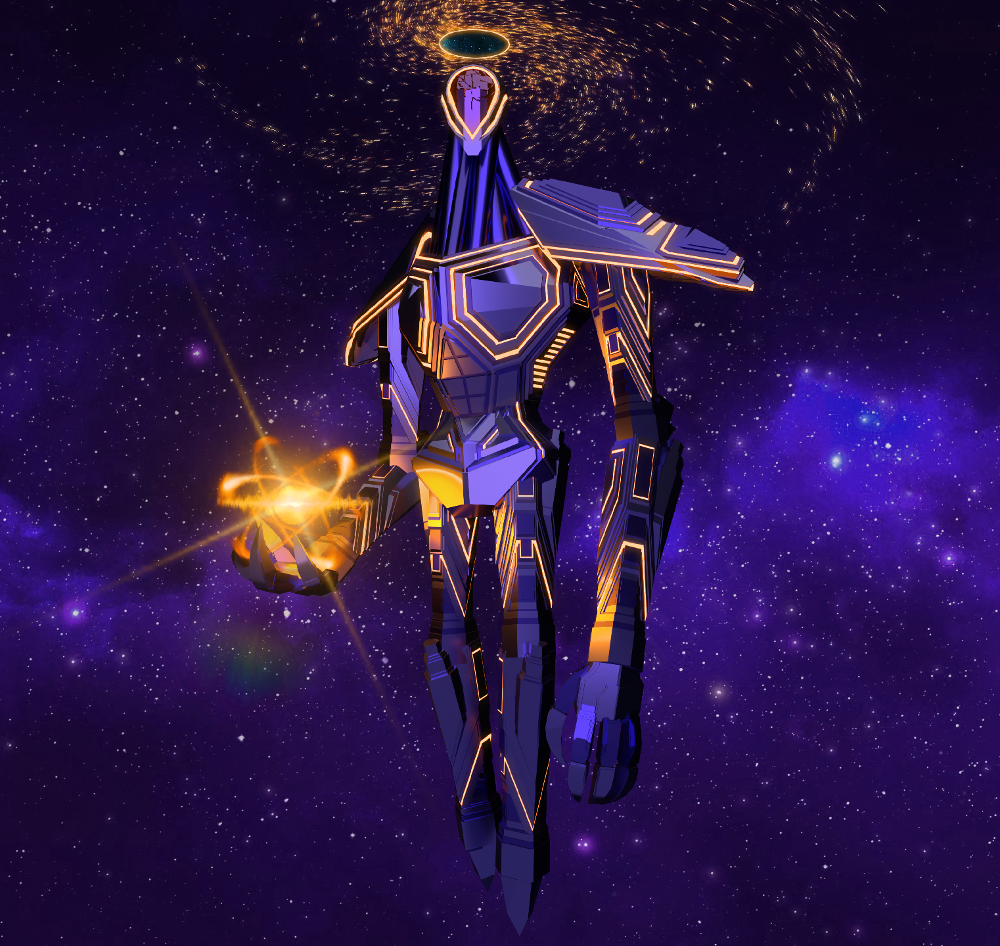

# The Celestine Conservator

!!! danger "Nothing on this page is a promised feature or guaranteed to be in the game."
    If you are seeing this warning bubble, here is a reminder that **this project is in early development.**

    **Content you see here is in a constant state of change. *NOTHING here a promise or guarantee of a feature in the game. Things change.***

***

## Overview

&nbsp;&nbsp;The Celestine Conservator is the titular character of the game, and a divine figure in the universe. It is a rather short (~1.2m) white marble statue. Pictures are included below.

&nbsp;&nbsp;Its head shape has yet to be really decided, there's two designs, one with a flat panel, the other with a ring.

!!! info "Disclaimer: The sound effect in this video is not present in the game."
    This is actually an ambient sound from *No Man's Sky*. I just have it in this video to help set the mood.
<video width="1920" height="1080" controls>
  <source src="../img/conservator_godot.mp4" type="video/mp4"> 
  <!-- Parent directory (..) is used due to a feature in mkdocs conflicting. -->
  <!-- https://github.com/squidfunk/mkdocs-material/discussions/3984#discussioncomment-7273750 -->
Your browser does not support the video tag.
</video> 
<small>ALT: A variation of the character model for The Celestine Conservator. It is a short figure made of white marble. There is no ground it is standing on, instead only an open sky. The sky is bright white on the bottom, and blue on the top. It is standing without animation, in its A-pose. The viewer first zooms into the head, an almost circular ring of white marble that is cut down the middle. A wisp is positioned inside of the hole of the ring, a bright cyan ball of light with swirling lines within it. The camera then moves backwards, and rotates around its torso, showing off an effect present on the armor and head wherein bright blue stars are visible within some of the surface. The right arm of The Conservator is a long, thin sword which has replaced its forearm. The stars change angle as the viewer moves, as if the viewer were looking through a portal. The viewer finally moves down to the legs and waist, showing off the marble material's slight colorations for varying parts of the body.</small>

&nbsp;&nbsp;The original head shape - a flat panel - also looks very appealing. Here is the original design of The Conservator before I made its armor.

<flex>
{width=45%}
{width=45%}
{width=45%}
{width=45%}
</flex>

## Character Story

&nbsp;&nbsp;The Conservator is one of those characters purposely left vague. It is *almost* a god. While it has the power of creation, it is not absolute; it does not see and know all, it is not omnipotent. This puts it in an interesting place where it may still operate on what feelings it chooses to allow itself to have, and may make decisions without knowledge of the consequences of any given action.

&nbsp;&nbsp;It has its own little world, a vast, blank, white expanse (a bit like the video above) with buildings and creatures made from the same four materials - white marble, gold, silver, glass, and the blue wispy soul energy. It resides in a small temple, swimming around the air, looking at the constellations in its hand, occasionally toying with creation. 

&nbsp;&nbsp;The context in which the player is able to find it is not something I'll cover, because that's a spoiler. Still, when the player does eventually find it, it doesn't seem to care for their presence at all. That is, until one moment, where it briefly looks up at the player, and gives them something...

&nbsp;&nbsp;What did the player receive? Play the game to find out!

## Design Inspiration

&nbsp;&nbsp;There were two people who significantly affected the design of The Conservator, and I need to give credit where it's due.

### Inspiration: *The Bishop*

&nbsp;&nbsp;An old friend of mine who went (or, goes?) by *Mercury* had designed a really awesome model, this really big alien/robot thing. It was a deep violet in color, with orange lines. It held a golden orb that looked like a depiction of an atom. Its body almost looked like *Forerunner* tech out of *Halo*.

&nbsp;&nbsp;It was this model that inspired the pose I use in the four images, though The Conservator holds an orb in its left hand rather than the right hand.

{width=45%} 

***

### *Kaviki*'s redesign of *Ani*

&nbsp;&nbsp;The person deserving of a significant amount of credit is *Kaviki*. Years ago I used to work on a Roblox game called *Creatures of Sonaria*. My dev species is called "Ani", and it is something from the same lore of this game, an older, long-obsolete creature. On occasion, the owners of *Sonaria* will choose to redesign older creature models as the game evolves and better artists are hired. When they do this, they (used to?) seek the community for artists willing to give up their designs to the game in exchange for a payment.

&nbsp;&nbsp;Kaviki was one of the artists that wanted to try to shoot their shot and get their design into the game. It was ultimately not selected. Now the thing is, I had actually not seen Kaviki's design until after the selection was made, and as horrible as it might be for me to say this, I am actually glad it wasn't selected.

{width=85%} 

&nbsp;&nbsp;You see, at the time I saw it, I was going through a bit of an identity crisis, riddled with mental complications and depression, still rebuilding myself after past drama. I had an idealized image of myself, this blank, expressionless thing. A feeling, an idea... And then Kaviki's design was thrown into my DMs by a friend who still played the game. It didn't even take a second, I looked at it, and said *"That's the one".* Actually, that doesn't do my reaction justice. **It was so perfect to me that I made the original Conservator model (shown in the four pictures above) in *less than a day.*** *That's* how significant it was to me. I have both ADHD and autism, so my focus is ordinarily terrible. You can connect the dots by now I am sure.

&nbsp;&nbsp;I am cutting out a huge chunk of detail, but the important part is the end result after I had help finding the artist to contact them. We had talked, and eventually I paid for the adoption of this design. It became, properly, mine. Even though The Conservator right now is not very similar to the original design (save for its body profile), it would be horrible of me to not put a shoutout to Kaviki here. If you are reading this, here is yet another thank you, and a reminder for just how important your design is to me.