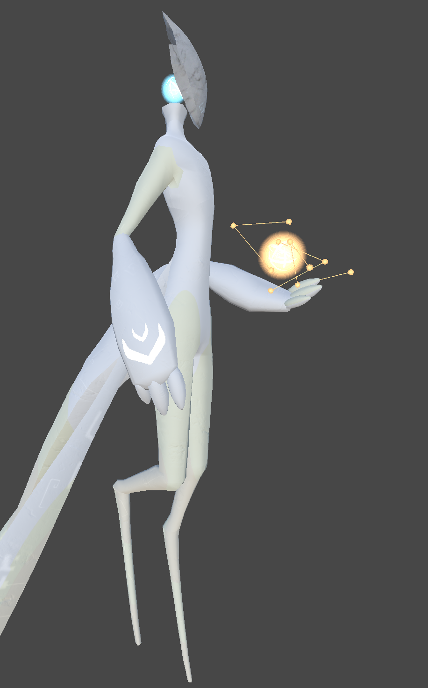
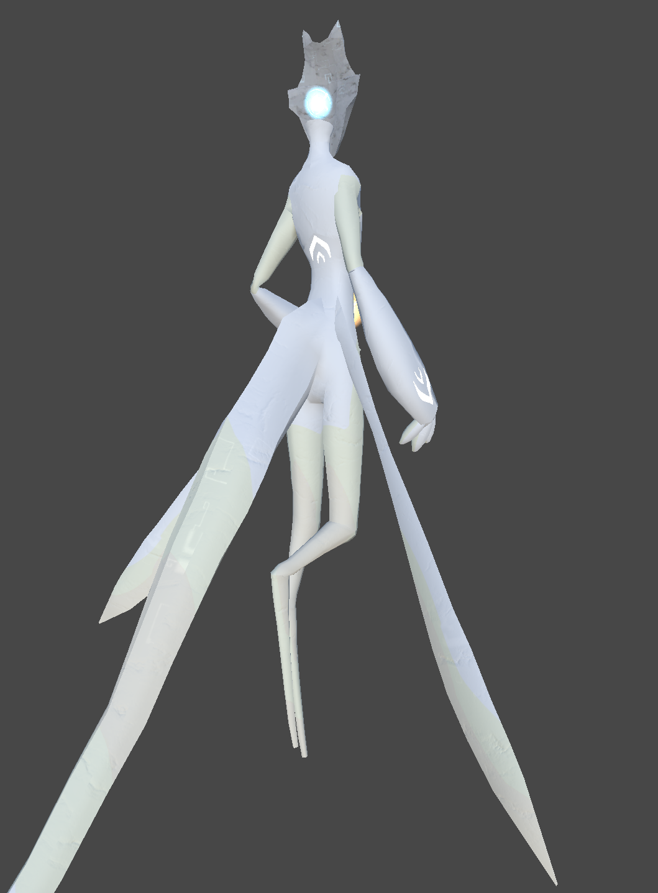
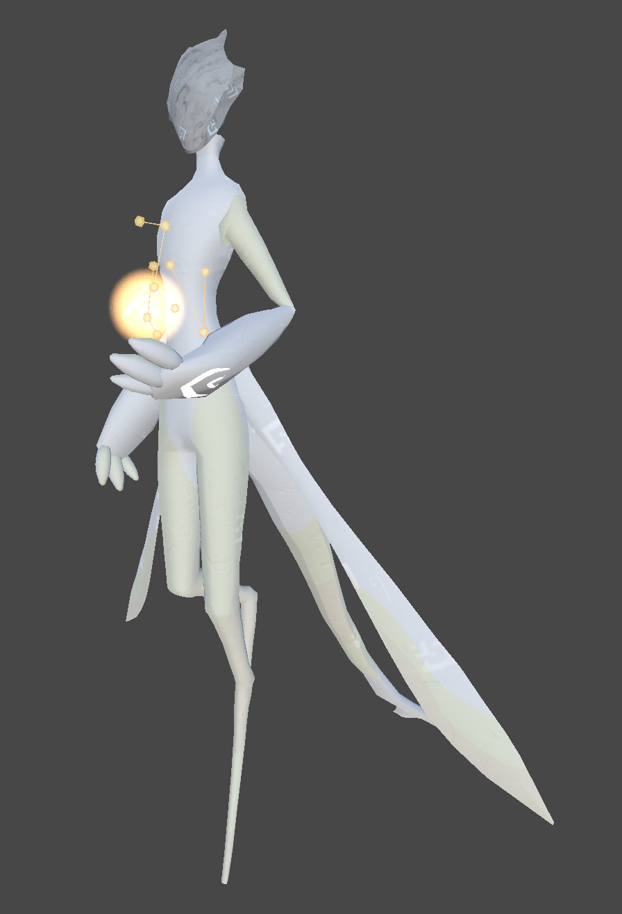

# The Celestine Conservator

!!! danger "Nothing on this page is a promised feature or guaranteed to be in the game."
    If you are seeing this warning bubble, here is a reminder that **this project is in early development.**

    **Content you see here is in a constant state of change. *NOTHING here a promise or guarantee of a feature in the game. Things change.***

***

## Overview

&nbsp;&nbsp;The Celestine Conservator is the titular character of the game, and a divine figure in the universe. It is a rather short (~1.2m) white marble statue. Pictures are included below.

&nbsp;&nbsp;Its head shape has yet to be really decided, there's two designs, one with a flat panel, the other with a ring.

!!! info "Disclaimer: The sound effect in this video is not present in the game."
    This is actually an ambient sound from *No Man's Sky*. I just have it in this video to help set the mood.
<video width="1920" height="1080" controls>
  <source src="../img/conservator_godot.mp4" type="video/mp4"> 
  <!-- Parent directory (..) is used due to a feature in mkdocs conflicting. -->
  <!-- https://github.com/squidfunk/mkdocs-material/discussions/3984#discussioncomment-7273750 -->
Your browser does not support the video tag.
</video> 
<small>ALT: A variation of the character model for The Celestine Conservator. It is a short figure made of white marble. There is no ground it is standing on, instead only an open sky. The sky is bright white on the bottom, and blue on the top. It is standing without animation, in its A-pose. The viewer first zooms into the head, an almost circular ring of white marble that is cut down the middle. A wisp is positioned inside of the hole of the ring, a bright cyan ball of light with swirling lines within it. The camera then moves backwards, and rotates around its torso, showing off an effect present on the armor and head wherein bright blue stars are visible within some of the surface. The right arm of The Conservator is a long, thin sword which has replaced its forearm. The stars change angle as the viewer moves, as if the viewer were looking through a portal. The viewer finally moves down to the legs and waist, showing off the marble material's slight colorations for varying parts of the body.</small>

&nbsp;&nbsp;The original head shape - a flat panel - also looks very appealing. Here is the original design of The Conservator before I made its armor.

<flex>
{width=45%}
{width=45%}
{width=45%}
{width=45%}
</flex>

## Character Story

&nbsp;&nbsp;The Conservator is one of those characters purposely left vague. It is *almost* a god. While it has the power of creation, it is not absolute; it does not see and know all, it is not omnipotent. This puts it in an interesting place where it may still operate on what feelings it chooses to allow itself to have, and may make decisions without knowledge of the consequences of any given action.

&nbsp;&nbsp;It has its own little world, a vast, blank, white expanse (a bit like the video above) with buildings and creatures made from the same four materials - white marble, gold, silver, glass, and the blue wispy soul energy. It resides in a small temple, swimming around the air, looking at the constellations in its hand, occasionally toying with creation.